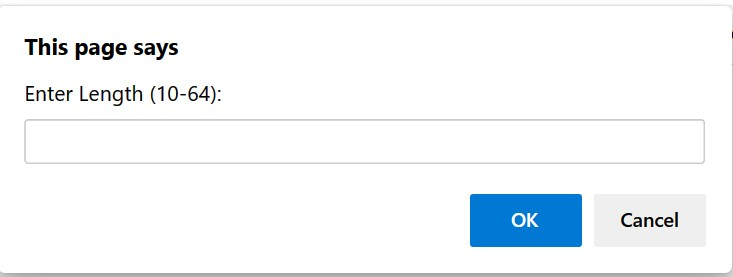
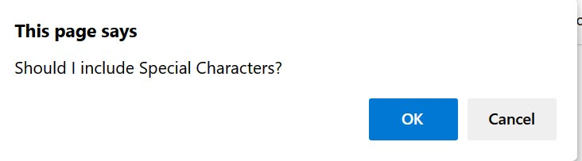
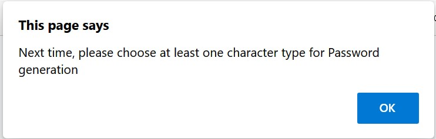
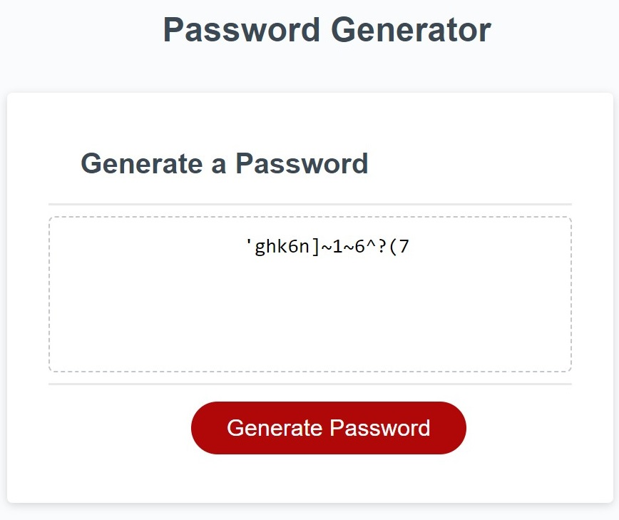

Program starts with establishing how many characters will be used for password. Password length checked if it's between 10 to 64(Function PassLengthInput()).

After correct number is entered, program establishes which type of the characters are used(Function getPasswordOptions()).

Program only continues if at least one type of the characters is selected for password.

Password sample is only combines the characters selected(Do-WHILE loop used).
This method provide whole sample, but original group of characters are in predictable order. Even though password are created by using randomize process, to increase security option newly created sample is randomized and rearranged, prior to peeking password character(Function rearrangeSample()).

Password are populated by pushing "Generated Password" button. Every time button is pushed new password will be display with the same property.
link to the live application https://ramaz-didi.github.io/Password-Generator-week5/

https://github.com/Ramaz-Didi/Password-Generator-week5

Screen shot of the live site

